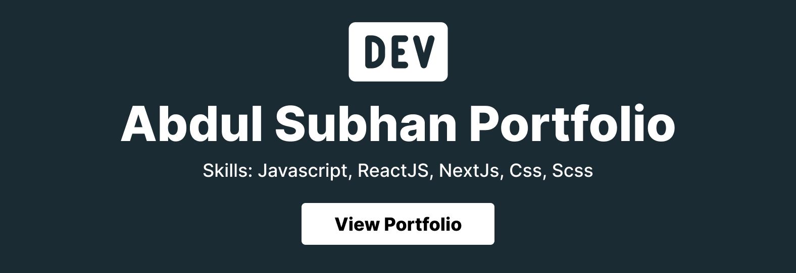

# Abdul Subhan | Full-Stack Developer Portfolio

<p align="center">
  
</p>

<p align="center">
  <a href="https://nodejs.org/"></a>
  <a href="https://react.dev/"></a>
  <a href="https://tailwindcss.com/"></a>
  <a href="https://www.framer.com/motion/"></a>
  <a href="https://www.docker.com/"></a>
  <a href="https://opensource.org/license/mit"></a>
</p>

A modern, interactive, and professional developer portfolio designed to showcase full-stack engineering experience, product thinking, education, achievements, projects, and technical expertise. This project presents a polished personal brand with premium UI/UX, motion-rich storytelling, responsive layouts, and a strong emphasis on clarity, performance, and visual impact.

## Project Overview

This portfolio is more than a static resume. It is a thoughtfully crafted digital experience built to help recruiters, collaborators, and hiring teams quickly understand the developer’s breadth of expertise, problem-solving style, and product vision. The site combines elegant visual design with strong technical implementation and modern web practices to create a memorable first impression.

### Goals

- Present a professional and memorable personal brand online
- Highlight full-stack development, UI/UX, AI-oriented product thinking, and delivery experience
- Showcase projects, education, achievements, and technical skills in a structured way
- Provide a fast, responsive, and visually compelling experience across desktop and mobile
- Create a reusable portfolio foundation that can be customized with personal content

### What makes this project unique

- A premium, modern interface with animated transitions and immersive sections
- Responsive and accessible design language tailored for developers and tech audiences
- Content-driven architecture that keeps portfolio details centralized and easy to maintain
- A blend of polished frontend experiences and data-driven sections powered by GitHub integrations
- A flexible foundation suitable for personal branding, consulting, freelance work, and open-source visibility

## Technology Stack

The project is built as a React-based single-page application with a strong emphasis on visual polish, performance, and maintainability.

### Frontend

- React 18 — Core UI framework for building reusable, component-driven interfaces
- React DOM — Rendering layer for the SPA experience
- React Scripts — Local development workflow, build pipeline, and production bundling
- CSS and custom styling — For layout, theming, spacing, typography, and responsive behavior
- Tailwind CSS — Utility-first styling support for scalable and maintainable UI composition

### Animation & Motion

- Framer Motion — Smooth component transitions, micro-interactions, and animated section reveals
- GSAP — Advanced timeline-based animation support for richer motion experiences
- Lucide React — Lightweight and modern icon system for a clean interface

### 3D / Visual Experience

- Canvas-based particle and visual background effects — Used to create immersive, layered, motion-driven visual depth
- Custom animated components — Designed to give the portfolio a more dynamic and premium feel without depending on a heavy 3D stack

### AI & Data-Driven Experience

- AI-inspired product storytelling and experience design — The portfolio is framed around modern digital product thinking and intelligent user experiences
- GitHub GraphQL integration via Node.js scripts — Used to fetch open-source activity, issues, pull requests, and organization contributions dynamically

### Backend / Runtime

- Node.js — Runtime environment for development and GitHub data-fetching scripts
- Express-style tooling patterns are not used as a traditional backend service; this portfolio is primarily a frontend application with lightweight runtime automation

### Database

- No dedicated database is required for the current deployment model
- Portfolio content is maintained through static configuration files and JSON-based data assets

### Development Tools

- npm — Dependency management and scripts
- Docker — Containerized development and local execution support
- Prettier and lint-staged workflows — Formatting and consistency support for authored content and code

### Deployment Platforms

- GitHub Pages — Supported deployment target
- Netlify — Live preview and hosting option
- Docker — Local containerized deployment option

### Version Control

- Git — Source control
- GitHub — Repository hosting, collaboration, and deployment workflows

## Features

- Modern responsive design optimized for desktop, tablet, and mobile devices
- Interactive animations and smooth page transitions throughout the experience
- Immersive visual effects and animated backgrounds for a premium first impression
- Professional sections for introduction, skills, experience, education, achievements, and projects
- Project showcase with structured highlighting of technical impact and capabilities
- Skills and expertise display with visual emphasis on core technologies
- Contact section with professional links and direct communication options
- Resume download and external portfolio link support
- Optimized performance with a lightweight static-first architecture
- SEO-friendly metadata and structured page information
- Accessibility-conscious layout practices and readable content hierarchy

## Project Structure

```text
abdul-subhan-portfolio/
├── public/                 # Static assets, favicons, manifest, SEO files
├── src/                    # Main application source code
│   ├── assets/             # Images, fonts, icons, and media assets
│   ├── components/         # Reusable UI building blocks and cards
│   │   ├── Canvas/         # Visual effects and animated backgrounds
│   │   ├── footer/         # Footer and theme toggle UI
│   │   ├── header/         # Navigation and hero content
│   │   └── ...             # Project cards, skill cards, experience UI, etc.
│   ├── containers/         # Page-level composition and section grouping
│   ├── contexts/           # React context providers if used by the app
│   ├── pages/              # Route-based page content and layouts
│   ├── shared/             # Shared content, JSON data, and open-source data
│   ├── styles/             # Global style helpers and shared visual styling
│   ├── utils/              # Utility helpers and reusable logic
│   ├── App.js              # Main application component
│   ├── index.js            # Application entry point
│   ├── portfolio.js        # Central portfolio content configuration
│   ├── theme.js            # Theme definitions and style variables
│   └── global.js           # Global app helpers and configuration
├── docker-compose.yaml     # Docker Compose configuration
├── Dockerfile              # Container build instructions
├── env.example             # Example environment variable file
├── git_data_fetcher.mjs    # GitHub GraphQL data sync script
├── package.json            # Project dependencies and scripts
├── tailwind.config.js      # Tailwind configuration
├── postcss.config.js       # PostCSS configuration
└── README.md               # Project documentation
```

### Key folders and files

- public/ — Static files such as the HTML shell, manifest metadata, favicon assets, and SEO-related files
- src/components/ — Reusable UI elements including cards, buttons, headers, footers, charts, and visual components
- src/containers/ — Higher-level section compositions used to assemble pages
- src/pages/ — Page-level modules for home, experience, projects, contacts, education, and more
- src/shared/ — Shared content and fetched GitHub data such as issues, pull requests, and organizations
- src/portfolio.js — Core content source for biography, skills, social links, resume details, and portfolio metadata
- src/theme.js — Color themes and app-wide visual styling configuration
- git_data_fetcher.mjs — Node-based script that pulls open-source contribution data from GitHub’s GraphQL API

## Installation & Setup Guide

### 1. Prerequisites

Make sure the following tools are installed on your machine:

- Node.js 20.x or newer
- npm 10.x or newer
- Git
- Docker (optional, for container-based development)

### 2. Clone the repository

```bash
git clone https://github.com/subhan8799/abdul-subhan-portfolio.git
cd abdul-subhan-portfolio
```

### 3. Install dependencies

```bash
npm install
```

### 4. Configure environment variables

Copy the sample environment file and update the values as needed:

```bash
cp env.example .env
```

Then edit the `.env` file with your GitHub credentials if you want to fetch live GitHub activity data.

### 5. Run the development server

```bash
npm start
```

The application will start locally in your browser at the default React development URL.

### 6. Build the production version

```bash
npm run build
```

This generates an optimized production build for deployment.

### 7. Deployment instructions

#### Option A: GitHub Pages

```bash
npm run deploy
```

This builds the app and publishes the production bundle to the GitHub Pages branch.

#### Option B: Netlify / Vercel / Static Hosting

- Connect the repository to your hosting platform
- Set the build command to `npm run build`
- Set the publish directory to `build`

#### Option C: Docker

```bash
docker compose up --build
```

The app will be available on port 3001 by default.

## Environment Variables

The project currently uses the following environment variables for GitHub data fetching.

| Variable | Purpose | Example |
| --- | --- | --- |
| GITHUB_TOKEN | Personal access token used by the GitHub GraphQL fetch script | `ghp_xxxxxxxxxxxxxxxxxxxx` |
| GITHUB_USERNAME | GitHub username whose profile data should be fetched | `subhan8799` |

### Security recommendations

- Never commit real secrets to the repository
- Keep tokens in local environment files or secure secret managers
- Rotate access tokens regularly if they are exposed
- Prefer read-only GitHub tokens for public profile integrations

## Development Workflow

### Run locally

Use the standard React development workflow:

```bash
npm start
```

### Add a new component

1. Create the component in `src/components/`
2. Import it into the relevant container or page
3. Keep the component focused and reusable
4. Use consistent naming and styling patterns

### Update portfolio content

Most editable content lives in:

- `src/portfolio.js` for profile information, social links, projects, skills, and resume links
- `src/theme.js` for color and visual theme selection
- `public/index.html` for page metadata and SEO defaults

### Code formatting

The project uses Prettier-style formatting and React-friendly conventions. Keep files readable, modular, and consistent.

### Git workflow recommendations

- Create feature branches such as `feature/your-update`
- Use descriptive commit messages
- Keep pull requests focused and well-documented
- Avoid committing generated build artifacts unless intentionally publishing them

## Project Details

### Design approach

The portfolio is designed around clarity, trust, and visual confidence. It aims to feel modern and professional while remaining easy to navigate and highly readable.

### UI/UX principles

- Clean visual hierarchy
- Strong typography and spacing
- Motion used as a supporting feature, not a distraction
- Consistent interactions and polished transitions
- Mobile-first responsiveness and intuitive navigation

### Animation strategy

Animations are used to add depth and personality without overwhelming content. Motion is carefully applied to section entrances, cards, and UI transitions to guide attention and improve perceived quality.

### Performance optimization

The app is optimized for speed and responsiveness through:

- Lightweight component structure
- Static-first content delivery
- Efficient asset organization
- Minimal unnecessary dependencies for the current feature set

### Accessibility considerations

The experience is intended to be approachable and readable, with semantic structure, strong contrast, and clear content flow. Continued improvements should focus on keyboard navigation, screen-reader support, and robust focus states.

### SEO implementation

The project uses metadata configuration and public HTML defaults to help search engines understand the site’s purpose. The portfolio content is also structured to be human-readable, descriptive, and professional.

## Future Improvements & Roadmap

Planned enhancements for the portfolio include:

- Additional AI-powered features such as intelligent content recommendations or personalized experience flows
- More advanced animated interactions and richer 3D-inspired visual effects
- Improved personalization based on visitor behavior and interests
- New project integrations and expanded showcase sections
- Better performance profiling and bundle optimization
- Enhanced accessibility coverage and inclusive design refinements
- Additional developer tool integrations and visual data storytelling

## Contribution Guidelines

Contributions are welcome. To keep the project professional and maintainable:

- Follow the existing project structure and coding style
- Keep components modular and focused on a single responsibility
- Write clean, readable, and well-documented code
- Prefer small, well-scoped pull requests

### Branch naming

Use clear branch names such as:

- `feature/your-feature-name`
- `fix/issue-description`
- `chore/maintenance-task`

### Commit message guidelines

Use concise messages that describe the change clearly, for example:

```bash
git commit -m "feat: add new project section"
```

### Pull request process

1. Create a branch from the latest main branch
2. Make your changes and test locally
3. Open a pull request with a clear summary and rationale
4. Include screenshots or notes if UI changes are involved

## License & Contact

This project is licensed under the MIT License.

### Author

Abdul Subhan

### Contact

- Email: mian8799@gmail.com
- GitHub: https://github.com/subhan8799
- LinkedIn: https://www.linkedin.com/in/abdul-subhan-b00b8623a/
- Website: https://abdulsubhan.com/

If you would like to collaborate, discuss the project, or adapt this portfolio for your own personal brand, feel free to reach out.

